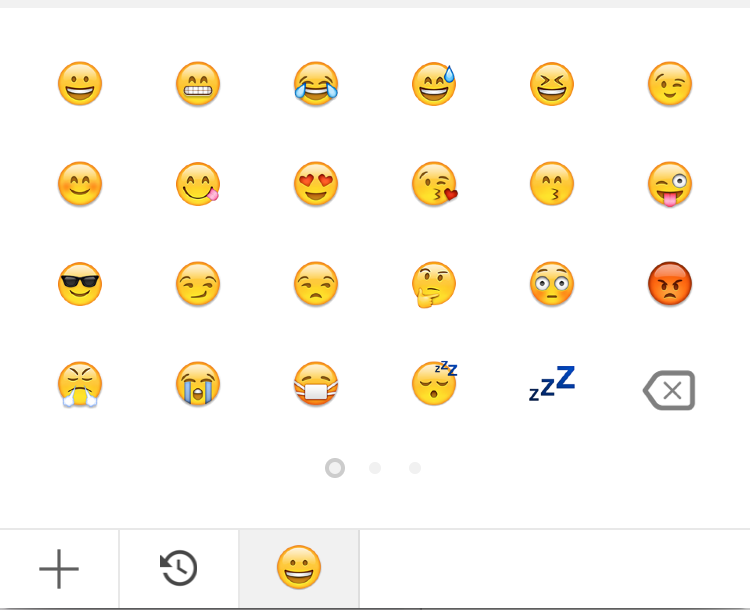

# React Native Emoticons
react native emoticons component, including emoji


### latest screenshot sample


<!---->
## Install

```js
npm install react-native-emoticons
```

## Usage

### UI Component

- step 1

	Import the component package.
	
	```js
	import Emoticons from 'react-native-emoticons';
	```
- step 2

	Write the component code in the proper place of your page render.
	
	```js
	<Emoticons
        onEmoticonPress={this._onEmoticonPress.bind(this)}
		 onBackspacePress={this._onBackspacePress.bind(this)}
        show={this.state.showEmoticons}
        concise={true}
        showHistoryBar={true}
        showPlusBar={true}
     />
	```
	> **Tip:**  The attribute `onEmoticonPress ` can get the emoticos results like `{code:'😁', name: 'GRIMACING FACE'}`. The attribute `show ` will control that if the component is visible.  The attribute `onBackspacePress ` will add a function for backspace button. 
	
### API

Import

```js
import * as emoticons from 'react-native-emoticons';
```

1. stringify
	
	```js
	//Most database can't restore the emoji string😤,so we map 
	//them to common string.
	
	const string = emoticons.stringify('This is source emoji 😁');
	console.log(string);
	```
	```js
	//output
	'This is source emoji [GRIMACING FACE]'
	```
	
2. parse

	```js
	//If we want to show the emoji(fetch from database) in view page
	//we need parse the string
	
	const emoji = emoticons.parse('This is source emoji [GRIMACING FACE]');
	console.log(emoji);
	```
	```js
	//output
	'This is source emoji 😁'
	```

3. splitter

	```js
	//this api is for backspace function
	const emoji = emoticons.splitter('emoji😁');
	console.log(emoji);
	```
	```js
	//output
	['e','m','o','j','i','😁']
	```


## Further
	
###	Support custom emoticons like `weixin`
